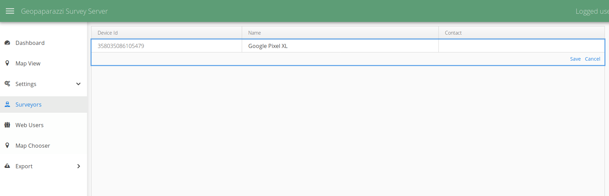

= Geopaparazzi: state of the art of the digital field mapping application
:name: value
:gss_version: v2.15
:icons: font
:revealjsdir: reveal.js
:revealjs_theme: hydrologis
:revealjs_transition: fade
:revealjs_center: true
:revealjs_history: true
:revealjs_mouseWheel: true
:revealjs_help: true
:revealjs_slideNumber: false
:revealjs_controls: false
:revealjs_viewDistance: 4
//:revealjs_parallaxBackgroundImage: first_page.png
//:revealjs_parallaxBackgroundSize: no-repeat,contain
:source-highlighter: coderay
:title-slide-background-image: images/huge_icon.png
//:title-slide-background-color: red
:title-state: centerp

> Andrea Antonello, Silvia Franceschi
>
> HydroloGIS s.r.l.
>
> Foss4G - Bucharest
>
> August 29th 2019

== 開発者紹介
//image::images/huge_icon.png[background, size=contain]

* cofounder of http://www.hydrologis.com[HydroloGIS]
* Contract professor in Advanced Geomatics at the https://www.unibz.it/[Free University of Bolzano]
* http://www.osgeo.org[Osgeo] Charter Member and GFOSS advocate
* develop and coordinate http://www.geopaparazzi.org[Geopaparazzi]
* develop and coordinate the http://www.hortonmachine.org[HortonMachine project]

[background-color="#378756"]
== What is Geopaparazzi?

[cols="35, 65"]
|===

a|
image::images/01_himeji.jpg[]

a|
* 基本的にエンジニアリング調査ツール
しかし、緊急管理、一般的な野外活動（スポーツ）、観光にも使用できます
* 必要なときに常に手元に
* ジオリファレンスされた写真、メモ、gpsログを収集できます
* 使いやすく直感的
{empty} +
{empty} +
|===

== 基本機能

image::images/geopaparazzi_00.png[width=70%]

NOTE: Notes, images and gps logs はプロジェクトファイルの中に保存されます。

[background-color="#378756"]
== 大きな移行

* 古い mapsforge バージョンはロックされます
* 新しいレンダリングシステムに移行するための資金を探しています
* 検討中
    - Nasa World Wind Android（OSMタイルシステムなし）
    - 最新の mapsforge

== 課題

* mapsforgeマップファイルv5はサポートされなくなりました
* AndroidはHTTP接続の許可を停止しました
* https for tiles -> 多くのフリーズが発生します

[background-color="#378756"]
== VTMへの移行

**NWW Androidがシャットダウンされた**ため、除外により**mapsforgeが完璧なツール**であると判断しました。
After a initial try with the latest mapsforge and a small test with VTM, we then decided to go with the **Vector Tile Map project**.
最新のmapsforgeでの最初の試行とVTMでの小さなテストの後、**ector Tile Mapプロジェクト**に進むことにしました。
どうして？ それは非常に滑らかで、3Dが魅力的だからです...そして、ベクタータイルがあります。

== 今どこにいるの？

1. 移行が完成しました。
2. geopaparazziをAndroid 5互換に戻しました。
3. ユーザーマニュアルは、ほぼ完全に新しいバージョンに移植されました。 私をポイント2に押し上げてくれたBrent Fraserに感謝します。
4. 開発中に数か月間内部テストされました

[background-color="#378756"]
== 機能を教えてください!!!

== レイヤー

[text-align="center"]
最終的にレイヤーを使用できます。

image::newimg/01_layers.png[width=70%]

== !

そして、ドラッグ&ドロップができます。

image::newimg/02_layers_dnd.png[width=30%]

== !

レイヤーはmapsforgeの上にmbtilesをオーバーレイすることができます。

image::newimg/03_overlay.png[width=30%]

== !

ソースレイヤーのプロパティに対応しています。

たとえば、MBTilesレイヤーの透過度をセットすることが可能です。

image::newimg/04_transparency.png[width=70%]

== 編集可能レイヤー

レイヤーが編集可能である場合（Spatialiteレイヤー）、レイヤービューから編集できるようになります:

image::newimg/11_editing.png[width=70%]

== 新しいマッププロパティ

**マップはスムーズです。**

VTMに付属するグラフィックアクセラレーションは、ユーザーにとって喜びです。

マップは、パフォーマンスの劣化なしに回転できます。

== マッップ回転

マップビューは、GPSの方向を追跡するために、ユーザーが自動的に、または自動的に回転させることができます。

メモのラベルとmapsforgeマップのポイント情報のラベルは、回転規則に従います:

image::newimg/05_rotation.png[width=70%]

== 3D

**Mapsforgeマップ**およびベクタータイルレイヤーに含まれる建物の3Dレイヤーを表示することができます。

image::newimg/06_3d.png[width=100%]

//== VTM Themes
//
//It is also possible to apply themes to VTM compatible layers. Mind that not always the theme definition is
//compatible with the dataset. That happens often with online vector tile sources.
//
//image::newimg/07_themes.png[width=100%]

== ラベルと 3D レイヤ

生成された3Dおよびラベルレイヤーは、他のすべての上に常に保持され、利用可能なマップの上に建物を表示できます。

image::newimg/08_3dover.png[width=50%]

== Mapsforge マップ

これらのすべての追加生成されたレイヤーによる完全なカオスを回避するために、mapsforgeマップは一緒にマージされ、単一のマップとして処理されます。

image::newimg/09_multimap.png[width=100%]

== GPS info

GPSボタンの中央を長くタップすると、ナビゲーションオプションが表示されます。

image::newimg/10_gpsinfo.png[width=60%]

[background-color="#d52a2a"]
== その開発過程で何が失われたでしょう？

== !

移行プロセス中に一部の機能が失われました:

* WMSレイヤーをロードするmapurl
* spatialite層ラベル
* ラインキャップと結合

また、現在、VTMでのラインキャップと結合のサポートが欠落しているために、ワイドズームアウトの
spatialiteポリゴンレイヤーにはいくつかの問題があります（まだ調査中）。

== !

image::newimg/12_issue.png[width=70%]

[background-color="#378756"]
== IOS support

最近、GeopaparazziのIOSサポートに取り組み始めました。

プロジェクトの分析中に、いくつかのことに気づきました:

* これは、よりプロフェッショナルな名前を選択する瞬間でした。 ジオパパラッチは長年にわたって多くの批判を受けていました。
* ユーザーインターフェイスを再検討する必要がありました。 ダッシュボードは役に立たないという感じでした。

== 創世記

マーケティングの専門家と長い議論を重ねた結果、合理的なマッパーや測量士を引き付ける新しいアプリケーションの名前を最終的に決定しました。:

**測量士の幸せのためのスマートモバイルアプリケーション**

== !

image::newimg/smash.png[width=100%]

== SMASH

SMASHはflutterで記述されたアプリケーションであり、AndroidとIOSの両方でリリースされています。

geopaparazziの基本的な調査機能のほとんどを備えています。

今日、最初のバージョン** 0.1.0 **のテストを呼びかけます。

== SMASH

SMASHはマップビューで直接開き、下部のツールバーと、あまり一般的でない操作のための左右のスライダーを備えています。

image::newimg/13_smash.png[width=100%]

== Geopaparazziに対する弱点

* spatialiteのサポートなし
* mapsforgeマップのマップパフォーマンスはまだ驚くほどではありません
* すべてのフォームタイプがまだサポートされているわけではありません
* 距離およびログ分析ツールがありません
* ブックマークなし
* バックグラウンドロギングなし

== 互換性

プロジェクトデータベースは完全に互換性があります。 SMASHは、いくつかのテーブルを追加情報で拡張するだけです。

image::newimg/21_compatibility.png[width=90%]

== 何がいいの

* **iPhoneおよびiPadで動作します**
* すべての最も重要なツールは、メインビュー...マップから利用できます。
* オンラインTMSソース、mbtiles、gpx、mapsforgeをサポート
* アイコン、アイコン、アイコン、美しいUI
* 統合されたmapsforgeマップのダウンロード
* プロジェクトの共有（iOSユーザーにとって重要）
* 地図の回転/GPSの中心
* ノートのクラスタリング

== マップビュー

image::newimg/14_mapview2.png[width=80%]

== ノート

image::newimg/15_notes2.png[width=100%]

== !

マップ上でメモをタップすることができます。これにより、情報をすばやく確認したり、メモを削除または編集したり、可能であれば画像を表示したりできます。

image::newimg/20_tap_note.png[width=70%]

== フォーム

フォームがgeopaparazziと同じように動作します。 アイコンもサポートし、一般的にユーザーエクスペリエンスがよりスムーズになります。

image::newimg/16_forms.png[width=100%]

== ログ

ロギングは、ログアイコンから切り替えることができ、基本的なスタイル設定をサポートしています。

image::newimg/17_logs.png[width=100%]

== GPS情報/ツール

中央のボタンをタップすると、地図の中心がGPSの位置になりますが、長押しするとGPS情報パネルが開き、GPSを中心に、地図を回転させて座標をコピーできます。

image::newimg/18_gpstools.png[width=20%]

== レイヤービュー

レイヤービューから、オンライン（TMS）およびオフラインソース（mapsforge、mbtiles、gpx）を読み込むことができます。
それをサポートするソースを長タップすると、マップはソースの中心にズームします。

image::newimg/19_layers.png[width=20%]

== その他の気の利いたもの

完全な無料のFontAwesomeアイコンセットから、ノートに使用するアイコンのセット（_Available Icons_）を選択できます。

image::newimg/22_icons.png[width=80%]

== その他の気の利いたもの

アプリ内からmapsforge（_Offline Maps_）マップをダウンロードできます。
mapsforgeは低ズームレベルではパフォーマンスが低いため、ダウンロードの最後に**レベル4〜9のmbtilesキャッシュ**が作成されます。
どのような場合でも、mapsforgeの場合、ナビゲーション中にmbtilesキャッシュが作成されます。

image::newimg/23_offlinemaps.png[width=100%]

[background-color="#378756"]
== 今後のステップ

== GSSサポート

Geopaparazzi Survey Serverとの同期が、共同調査のために追加されます。

情報: http://bit.ly/gss-workshop

== ドキュメントとメーリングリスト

SMASHは、geopaparazzi のWebサイトにホームがあります。

ドキュメントがそこに追加されます。

---

SMASHは、メーリングリストをgeopaparazziと共有します。

---

**http://www.geopaparazzi.eu will still be main entrypoint.**

== 不足している機能を追加する

不足している機能の一部が追加されます:

* ブックマーク（誰かが実際に使用しているようです）
* 距離とログ情報ツール
* バックグラウンドロギング

== 少なくとも最後ではなく

* ローカライゼーション
* OSMポイントのサポート（同期）
* Mapillary？

[background-color="#378756"]
== 待って、どこで入手できますか？

== Geopaparazzi 6.0.0 RC1

現時点では、ここでテストの準備ができているリリース候補があります:

http://bit.ly/geopaparazzi-6-RC1

テストして不具合等お知らせください:

https://github.com/geopaparazzi/geopaparazzi/issues

== SMASH

iOSユーザーは、このURLにアクセスするtestflightアプリを使用してSMASHをテストできます:

http://bit.ly/smash-testing-ios

Androidユーザーはここでapkを入手できます:

http://bit.ly/smash-testing-android

[state=leftp]
== ども、ありがとう
image::newimg/smashtp.png[background, size=contain]

Homepage: http://www.geopaparazzi.eu

テスト中:

----
http://bit.ly/geopaparazzi-6-RC1
http://bit.ly/smash-testing-ios
http://bit.ly/smash-testing-android
----

Need help? Join the Mailinglist.
http://groups.google.com/group/geopaparazzi-users

Want to translate it in your language?
https://www.transifex.com/projects/p/geopaparazzi/

News about Geopaparazzi:
http://jgrasstechtips.blogspot.it/search/label/geopaparazzi
