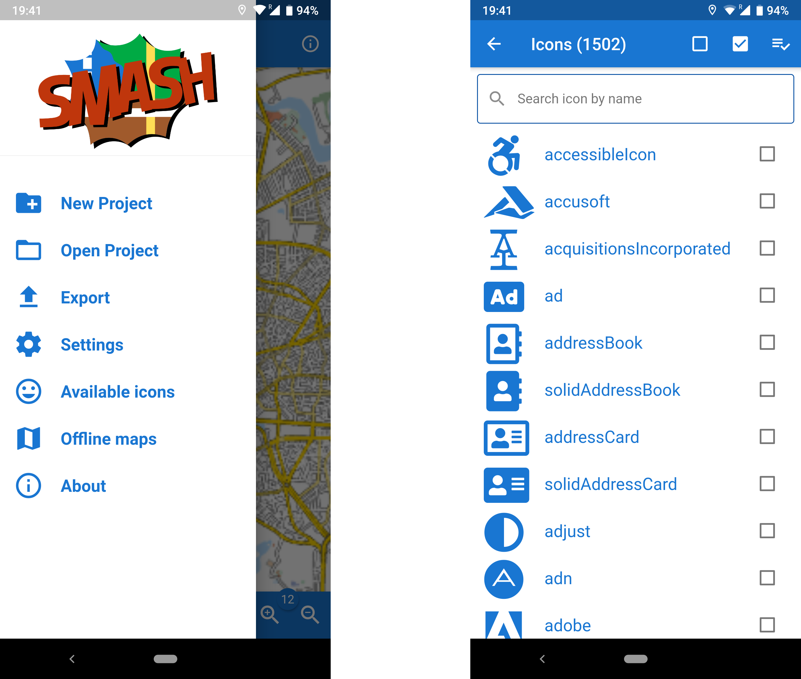

= Geopaparazzi: state of the art of the digital field mapping application
:name: value
:gss_version: v2.15
:icons: font
:revealjsdir: reveal.js
:revealjs_theme: hydrologis
:revealjs_transition: fade
:revealjs_center: true
:revealjs_history: true
:revealjs_mouseWheel: true
:revealjs_help: true
:revealjs_slideNumber: false
:revealjs_controls: false
:revealjs_viewDistance: 4
//:revealjs_parallaxBackgroundImage: first_page.png
//:revealjs_parallaxBackgroundSize: no-repeat,contain
:source-highlighter: coderay
:title-slide-background-image: images/huge_icon.png
//:title-slide-background-color: red
:title-state: centerp

> Andrea Antonello, Silvia Franceschi
>
> HydroloGIS s.r.l.
>
> Foss4G - Bucharest
>
> August 29th 2019

== 開発者紹介

* cofounder of http://www.hydrologis.com[HydroloGIS]
* Contract professor in Advanced Geomatics at the https://www.unibz.it/[Free University of Bolzano]
* http://www.osgeo.org[Osgeo] Charter Member and GFOSS advocate
* develop and coordinate http://www.geopaparazzi.org[Geopaparazzi]
* develop and coordinate the http://www.hortonmachine.org[HortonMachine project]

[background-color="#378756"]
== What is Geopaparazzi?

[cols="35, 65"]
|===

a|
image::images/01_himeji.jpg[]

a|
* basically an engineering survey tool
but it can be used also for emergency
management, general field activities
(sport) and tourism
* always at hand when needed
* can collect georeferenced pictures, notes and gps logs
* easy to use and intuitive
{empty} +
{empty} +
|===

== Base functionalities

image::images/geopaparazzi_00.png[width=70%]

NOTE: Notes, images and gps logs are saved in the project file.

[background-color="#378756"]
== The big migration

* locked to ancient mapsforge version
* looking for funds to migrate to new rendering system
* considering
    - Nasa World Wind Android (no OSM tile system)
    - latest mapsforge

== Issues

* mapsforge map files v5 no longer supported
* android stopped permitting http connections
* https for tiles -> lot of freezing

[background-color="#378756"]
== The Migration to VTM

Since **NWW Android had been shut down**, we decided by exclusion that **mapsforge was the perfect tool**.

After a initial try with the latest mapsforge and a small test with VTM, we then decided to go with the **Vector Tile Map project**.

Why? Because it was extremely smooth and its 3D appealing... and it has vector tiles.

== Where are we right now?

1. The port is done.
2. We got geopaparazzi back to be Android 5 compatible.
3. The user manual has been almost completely ported to the new version. Thanks to Brent Fraser for this and for pushing me on point 2.
4. It has been internally tested for months during its growth

[background-color="#378756"]
== Give us some features!!!

== Layers

[text-align="center"]
We can finally use layers.

image::newimg/01_layers.png[width=70%]

== !

And they are drag and drop!

== !

They can be overlayed: mbtiles over mapsforge

== !

Depending on their source layers have properties.

For example it is possible to set a transparency for MBTiles layers:

== Editable layers

If a layer is editable (at the time spatialite layers), then it can be enabled for editing
from the layers view:

image::newimg/11_editing.png[width=70%]

== New map properties

**Maps are smooth.**

The graphics acceleration that comes with VTM is a joy for the user.

Maps can be rotated without performance payback.

== Map rotation

The map view can be rotated, either by the user or automatically to follow the GPS' heading.

Labels of notes and labels of the mapsforge maps point information obey to the rotation rules:

image::newimg/05_rotation.png[width=70%]

== 3D

It is possible to show a 3D layer of the buildings contained in **Mapsforge maps** and vector tile layers.

//== VTM Themes
//
//It is also possible to apply themes to VTM compatible layers. Mind that not always the theme definition is
//compatible with the dataset. That happens often with online vector tile sources.
//
//image::newimg/07_themes.png[width=100%]

== Labels and 3D layers

The generates 3D and labels layer are always kept on top of everything else, to be able to show buildings
on top of any map available.

image::newimg/08_3dover.png[width=50%]

== Mapsforge maps

To avoid a complete caos due to all these additionally generated layers, mapsforge maps are merged together
and handled as one single map.

image::newimg/09_multimap.png[width=100%]

== GPS info

Long tapping on the center on GPS button brings up the navigation options.

image::newimg/10_gpsinfo.png[width=60%]

[background-color="#d52a2a"]
== What did get lost in the process?

== !

Some features got lost during the migration process:

* mapurls to load WMS layers
* spatialite layer labelling
* line caps and joins

Also there are currently some issues with spatialite polygon layers on wide zoomouts,
probably due to missing support for line cap and joins in VTM (still investigating).

== !

image::newimg/12_issue.png[width=70%]

[background-color="#378756"]
== IOS support

Recently we started working on IOS support for Geopaparazzi.

During the analysis of the project we noticed a few things:

* this was the moment to choose a more **professional** name. Geopaparazzi had been criticized a lot over the years.
* the user interface had to be revisited. The feeling was that the dashboard was useless.

== The genesys

After long discussions with marketing experts we finally decided the name for the new application that
would attract any reasonable mapper and surveyor:

**Smart Mobile Application for Surveyor's Happyness**

== !

image::newimg/smash.png[width=100%]

== SMASH

SMASH is an application written in flutter and released for both Android and IOS.

It has most of the basic survey capabilities of geopaparazzi.

Today we call out for testing of its first version **0.1.0**.

== SMASH

SMASH opens up directly in the mapview and features a bottom toolbar and both left and right
a slider for less common operations.

== Weaknesses against Geopaparazzi

* no support for spatialite
* map performance for mapsforge maps is not yet amazing
* not all form types are yet supported
* distance and log analysis tool are missing
* no bookmarks
* no background logging

== Compatibility

The project database is completely compatible. SMASH just extends some of the tables with additional information.

image::newimg/21_compatibility.png[width=90%]

== What's good about it

* **IT WORKS ON IPHONE AND IPAD**
* all most important tools are available from the main view... the map.
* supports online TMS sources, mbtiles, gpx and mapsforge
* icons, icons, icons and a beatiful UI
* integrated mapsforge maps download
* project sharing (important for IOS users)
* map rotation/center on gps
* notes clustering

== The map view

image::newimg/14_mapview2.png[width=80%]

== Notes

image::newimg/15_notes2.png[width=100%]

== !

Notes can be tapped on the map, which allows for quick info and the possibility to delete or
edit the note or view the image, if available.

== Forms

Forms work the same way as in geopaparazzi. They support also icons and have in general a
smoother user experience.

image::newimg/16_forms.png[width=100%]

== Logs

Logging can be toggled from the log icon and supports some basic styling.

image::newimg/17_logs.png[width=100%]

== GPS Info/Tools

While tapping on the middle button centers the map on the GPS position, long tapping opens
the GPS info panel and the possibility to center on gps, rotate the map and copy the coordinates.

== Layer view

From the layer view it is possible to load online (TMS) and offline sources (mapsforge, mbtiles, gpx).
On long tap on sources that support it, the map zooms to the source center.

== Other nifty things

You can select (_Available Icons_) the set of icons you want to use for the notes from the complete free FontAwesome
icons set.

== Other nifty things

You can download mapsforge (_Offline Maps_) maps from within the app. Since mapsforge isn't performant at low zoomlevels,
at the end of the download **an mbtiles cache** for the level 4 to 9 is created. In any case for mapsforge an mbtiles
cache is created during navigation.

[background-color="#378756"]
== Future steps

== GSS support

Synchronization with the Geopaparazzi Survey Server will be added for centralized surveys.

For info: http://bit.ly/gss-workshop

image::images/06_surveyor.png[width=80%]

== Documentation and mailinglist

SMASH will find its home at the geopaparazzi website.

Documentation will be added there.

---

SMASH will also share the mailinglist with geopaparazzi.

---

**http://www.geopaparazzi.eu will still be main entrypoint.**

== Add missing features

Some of the missing features will be added:

* bookmarks (it seems somebody is really using them)
* distance and log info tool
* background logging

== Last but not least

* Localization
* OSM points support (synchronization)
* Mapillary?

[background-color="#378756"]
== Wait, where do I get it?

== Geopaparazzi 6.0.0 RC1

At the moment we have a Release Candidate ready for testing here:

http://bit.ly/geopaparazzi-6-RC1

Please test and let us know:

https://github.com/geopaparazzi/geopaparazzi/issues

== SMASH

IOS users can test SMASH using the testflight app accessing this URL:

http://bit.ly/smash-testing-ios

while Android users can get the apk here:

http://bit.ly/smash-testing-android

[state=leftp]
== THANKS FOR YOUR ATTENTION!

Homepage: http://www.geopaparazzi.eu

Testing:

----
http://bit.ly/geopaparazzi-6-RC1
http://bit.ly/smash-testing-ios
http://bit.ly/smash-testing-android
----

Need help? Join the Mailinglist.
http://groups.google.com/group/geopaparazzi-users

Want to translate it in your language?
https://www.transifex.com/projects/p/geopaparazzi/

News about Geopaparazzi:
http://jgrasstechtips.blogspot.it/search/label/geopaparazzi
